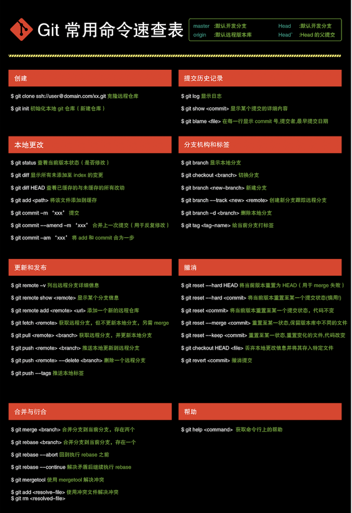
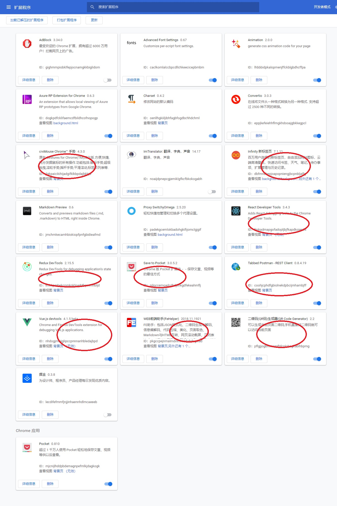

<!--
 * @Author: md-chen
 * @Date: 2020-12-25 16:22:34
 * @LastEditTime: 2020-12-25 16:54:47
 * @LastEditors: Please set LastEditors
 * @Description: 环境配置
 * @FilePath: /study/docs/notes/environment.md
-->
### 重装系统
- [系统下载](https://msdn.itellyou.cn/)

### Git环境
- [下载地址](https://git-scm.com/book/zh/v2/%E8%B5%B7%E6%AD%A5-%E5%AE%89%E8%A3%85-Git)
- [安装和公钥/私钥的配置](https://www.cnblogs.com/joyho/articles/4062574.html)
- 提交之前需要配置全局用户和密码，git commit的时候需要  
```
git config --global user.name "your name"  
git config --global user.email "you email"
```
- 常用命令

### Node环境
- [安装教程](https://www.cnblogs.com/zhouyu2017/p/6485265.html)
- 可以查看到node版本和npm版本即可
```
查看node版本 
node -v 
查看npm版本 
npm -v
```
- cnpm配置
```
npm install -g cnpm --registry=https://registry.npm.taobao.org
```
- 进阶：可以使用[nvm](https://github.com/creationix/nvm)管理window上的node版本


## 开发工具
### ConEmu安装
- [安装教程](https://www.jianshu.com/p/264e75aef8bb)
- 多个终端方便快速切换

### VSCode
- [汉化教程](https://jingyan.baidu.com/article/7e44095377c9d12fc1e2ef5b.html)

### 抓包工具 Charles
- [安装和破解](https://zhubangbang.com/charles-crack-version-free-download-and-install-tutorial.html)
- [使用教程](http://www.cnblogs.com/jiayuchn-test/p/8875105.html)

### 小飞机 ShadowSocks
- [安装教程](https://gitman6.github.io/cshow/windows.html)
- 使用以前的账号配置服务器

### Chrome
- 未翻墙，可以去[应用中心下载](https://pc.qq.com/detail/1/detail_2661.html)
- 已翻墙，去官网下载安装，后续安装插件
- 常用插件如下


## 沟通工具
- 企业邮箱
- 企业微信
- 钉钉
- 如流（百度）